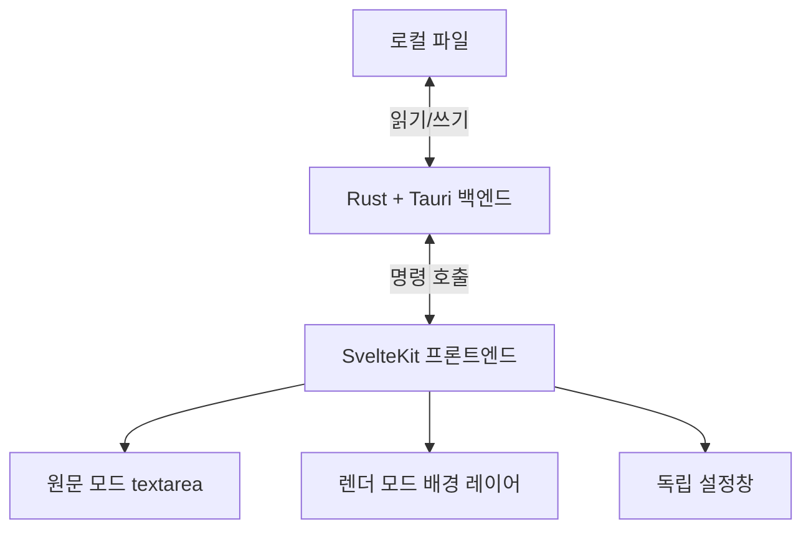

# text-pad 프로젝트 가이드

`text-pad`는 로컬 텍스트 파일을 원문 기준으로 보존하면서 읽기 좋은 렌더 모드를 제공하는 Tauri 데스크톱 편집기다.

Tauri는 Rust 백엔드와 웹 프론트엔드를 데스크톱 앱으로 묶는 프레임워크이고, SvelteKit은 화면을 구성하는 프론트엔드 프레임워크다.

## 현재 구조

## 주요 경로

- `src/routes/+page.svelte`: 메인 화면, 원문 모드, 렌더 모드, 설정창 UI.
- `src-tauri/src/lib.rs`: 파일 읽기/쓰기 명령, Windows 가로 휠 처리, Tauri 플러그인 설정.
- `src-tauri/capabilities/default.json`: 프론트엔드가 호출할 수 있는 Tauri 명령 권한.
- `src-tauri/tauri.conf.json`: 메인 창과 빌드 설정. 설정창은 실행 중 동적으로 만든다.
- `package.json`: SvelteKit, Tauri, Lucide 아이콘 의존성과 실행 명령.
- `docs/backend-guide.md`: 백엔드 계약.
- `docs/frontend-guide.md`: 프론트엔드 계약.
- `docs/features/file-workflow.md`: 파일 열기와 저장 흐름.
- `docs/features/render-mode.md`: 렌더 모드 표시 계약.
- `docs/features/settings-window.md`: 독립 설정창 계약.
- `docs/features/theme-preferences.md`: 테마와 사용자 설정 저장 계약.
- `docs/implementation-checklist.md`: 남은 기능과 완료 기준.

## 현재 기능 범위

- 여러 텍스트 계열 확장자 열기와 `.txt` 중심 저장.
- 원문 모드 편집.
- 렌더 모드 구문 강조, 들여쓰기 가이드, 줄 번호, 가상화된 화면 렌더링.
- 라이트/다크 테마, 렌더 색상, 글꼴, 글자 크기, 탭 크기 설정.
- 메인 창을 편집기 준비 뒤 표시해 첫 화면이 곧바로 입력 가능한 상태가 되게 하는 시작 흐름.
- 설정 버튼을 처음 눌렀을 때 독립 설정창을 동적으로 생성하고 표시.
- 설정창에서 파일 형식별 렌더 표시와 렌더 편집 모듈 켜기/끄기.
- Windows WebView2 가로 휠 입력 보정.
- Windows 릴리스 빌드 생성.

## 아직 제품 범위로 남은 기능

- 검색, 바꾸기, 특정 줄 이동의 완성도 개선.
- 저장 대화상자의 확장자 필터를 열기 대화상자와 맞추기.
- 앱 표시 이름과 번들 실행 파일 이름을 `text-pad`로 정리.
- Markdown 렌더링과 제한적 편집.
- JSON 트리 보기와 값 편집.
- CSV/TSV 표 보기와 셀 편집.
- YAML 구조 보기와 주석 보존형 편집.
- 파일 인코딩과 줄바꿈 보존 강화.

## 주요 명령

- `npm run check`: Svelte와 TypeScript 검사.
- `npm run build`: 프론트엔드 정적 빌드.
- `npm run tauri dev`: Tauri 개발 실행.
- `npm run tauri build`: Windows 실행 파일과 설치 파일 생성.

## 공통 기준

- 저장 기준은 항상 원문 텍스트다.
- 렌더 모드는 원문을 보기 좋게 표현하되 사용자의 공백, 들여쓰기, 줄바꿈, 구분자를 임의로 바꾸지 않는다.
- 큰 파일에서 입력과 스크롤이 느려지지 않아야 한다.
- 보안 위험이 있는 렌더링 기능은 기본 차단한다.
